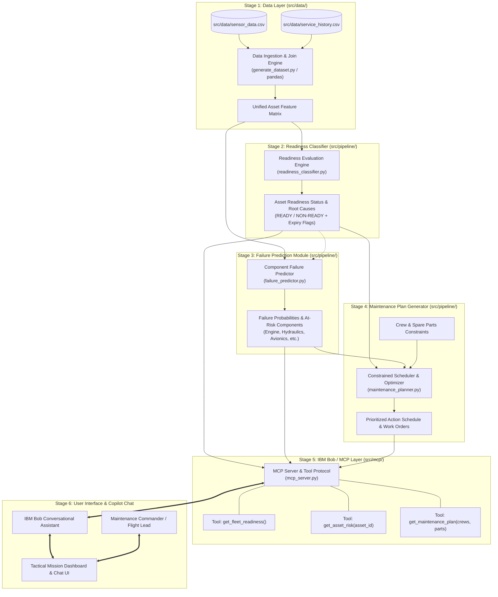

# System Architecture: Military Asset Mission-Readiness & Predictive Maintenance Copilot

## 1. End-to-End System Architecture



---

## 2. Component Table

| Component | Module / File | Technology | Responsibility |
| :--- | :--- | :--- | :--- |
| **Data Ingestion Layer** | `src/data/generate_dataset.py`, `src/data/sensor_data.csv`, `src/data/service_history.csv` | Python (`pandas`, `numpy`) | Ingests real-time telemetry and 2-year maintenance logs, normalizing timestamps and missing readings. |
| **Mission Readiness Classifier** | `src/pipeline/readiness_classifier.py` | Python (`pandas`) | Evaluates vibration (`>9 mm/s`), temperature (`>600°C`), oil quality (`<50`), and inspection limits (`>150 days`) to flag assets as READY or NON-READY. |
| **Predictive Failure Module** | `src/pipeline/failure_predictor.py` | Python (`pandas`, explainable heuristic scoring) | Calculates subsystem failure risk scores (0–100) across engine, hydraulics, fuel system, landing gear, and avionics. |
| **Maintenance Action Planner** | `src/pipeline/maintenance_planner.py` | Python (`pandas`, greedy constraint optimizer) | Prioritizes repairs by risk score and usage cycles, greedily allocating limited technician crews and spare parts. |
| **IBM Bob / MCP Layer** | `src/mcp/mcp_server.py`, `src/mcp/verify_mcp.py` | Python (`json`, JSON-RPC 2.0 / MCP Protocol) | Exposes stages 2–4 as callable tools so IBM Bob can answer natural language queries grounded in verified telemetry. |
| **Tactical Dashboard & Chat UI** | Stage 6 Dashboard | Web / Streamlit / FastAPI UI | Provides flight leads with real-time fleet health metrics, triage action boards, and conversational copilot chat. |

---

## 3. IBM Bob MCP Registration

To connect IBM Bob to this tool suite (per `bob.ibm.com/docs`):

```json
{
  "mcpServers": {
    "military-readiness-copilot": {
      "command": "python",
      "args": ["src/mcp/mcp_server.py", "--stdio"],
      "env": {}
    }
  }
}
```
